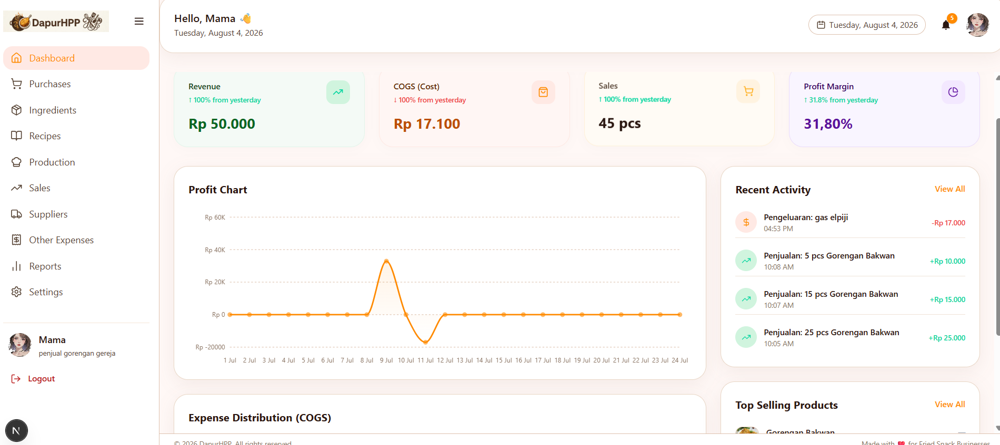
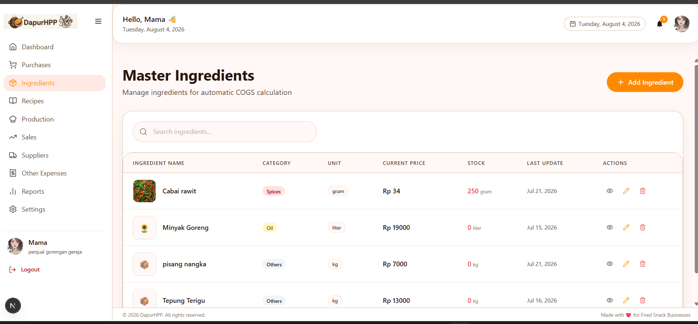
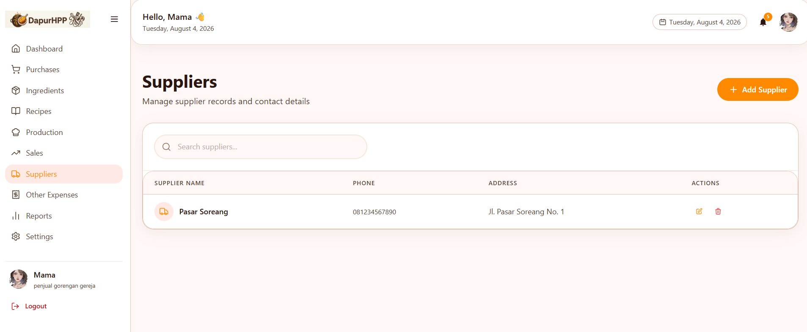
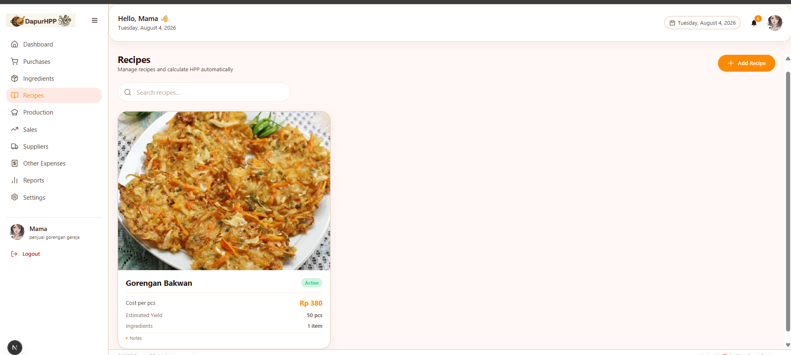
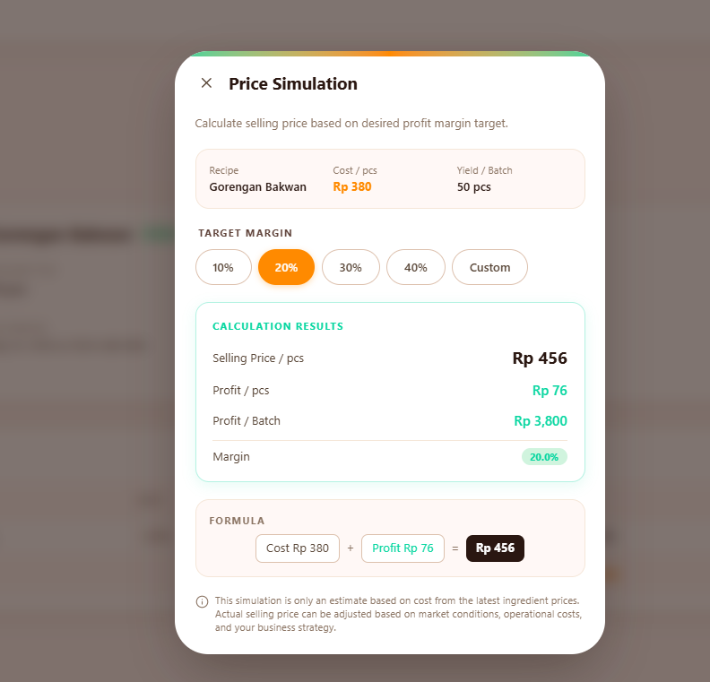
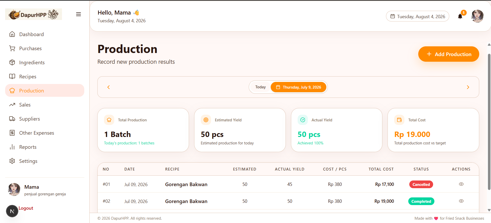
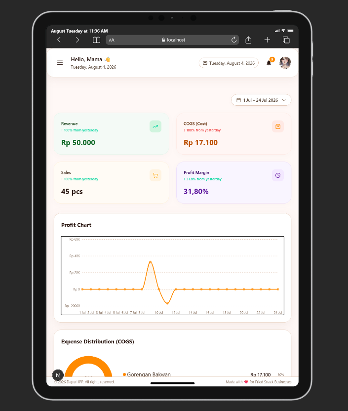
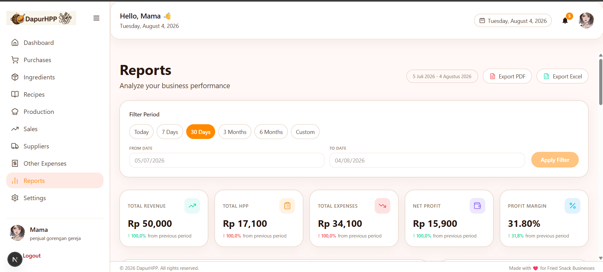
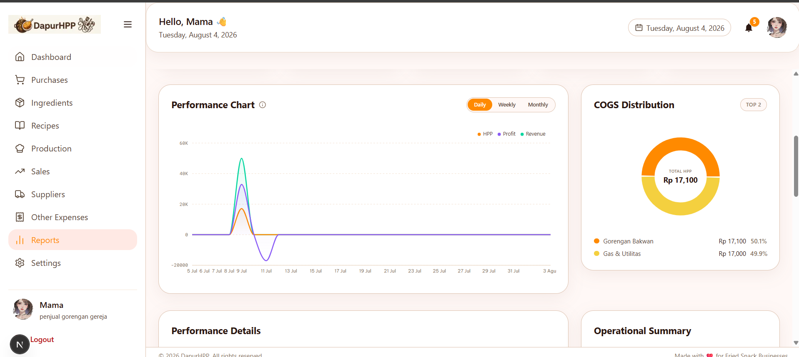

<div align="center">

# DapurHPP

**Web-Based Home Culinary Business Management Application**

[](https://nestjs.com)
[](https://nextjs.org)
[](https://www.typescriptlang.org)
[](https://prisma.io)
[](https://mysql.com)
[](https://tailwindcss.com)

<div className="flex gap-4 mt-6">
  <a href="https://youtube.com/..." className="btn-primary">
    🎬 90-sec Overview
  </a>
  <a href="https://dapurhpp.vercel.app" className="btn-secondary">
    🔗 Live Demo
  </a>
  <a href="https://github.com/ranggautama47/DapurHPP" className="btn-secondary">
    💻 GitHub
  </a>
  <a href="https://youtu.be/qLY8rPNWchA" className="btn-secondary">
    🎬 Full Demo
  </a>
</div>

</div>

A comprehensive business management application tailored for home-based culinary MSMEs. DapurHPP streamlines COGS (Cost of Goods Sold) calculation, raw material inventory management, production and sales tracking, and automated profit reporting.

Built as a full-stack developer portfolio, it is actively utilized in a real-world production environment by a family-owned fried food business as its primary user.

## 💡 Why DapurHPP?

Most home-based culinary businesses calculate their COGS manually on paper or spreadsheets. This manual approach is highly prone to calculation errors, lacks historical price tracking, and makes it difficult to identify which products are genuinely profitable. DapurHPP connects the entire

### 🍳 culinary business workflow into one seamless system:

> 🧑‍🍳 Ingredient Purchasing → Automated Stock Update → Recipe Management (COGS Snapshot) → Production → Sales → Profit Reporting

Every production batch saves a **snapshot of the COGS** at that exact moment. If ingredient prices increase the following week, the previous month's profit report remains unaffected. This is a deliberate and crucial architectural design, not a coincidence.

## 📸 Screenshots

  

<div align="center">
<table>
  <tr>
    <td width="50%" align="center">
      <h3>🏠 Dashboard</h3>
      
      <p><em>High-level daily business summaries + performance metrics</em></p>
    </td>
    <td width="50%" align="center">
      <h3>📦 Ingredients / Suppliers</h3>
      
      <h3>📦 Ingredients / Suppliers</h3>
      
      <p><em>Full CRUD with soft-delete, historical price tracking, image uploads</em></p>
    </td>
  </tr>
  <tr>
    <td width="50%" align="center">
      <h3>🧮 Recipe + COGS Calculation</h3>
      
      
      <p><em>Real-time COGS calculation + selling price simulation by target margins</em></p>
    </td>
    <td width="50%" align="center">
      <h3>🏭 Production Management</h3>
      
      <p><em>Atomic stock validation + immutable COGS snapshots locked at creation</em></p>
    </td>
  </tr>
  <tr>
  <td width="50%" align="center">
      <h3>📱 Responsive Design</h3>
      
      <p><em>Fully responsive for on-the-go access from any device</em></p>
    </td>
    <td width="50%" align="center">
      <h3>💰 Reports + Analytics</h3>
      
      
      <p><em>Trend charts, custom period filters, direct export to Excel / PDF</em></p>
    </td>

  </tr>
</table>
</div>

---

## 🛠 Tech Stack

### Backend (`dapurhpp-api`)

- **Framework:** NestJS 11 + TypeScript (Strict Mode)
- **Database:** Prisma ORM + MySQL 8 (Dockerized)
- **Authentication:** JWT (Access token + HTTP-only Refresh Cookie)
- **Email Service:** Nodemailer + Gmail SMTP for transactional emails
- **Security & Rate Limiting:** `@nestjs/throttler` configured globally (`ttl: 60000, limit: 120`) to prevent brute-force and DDoS attacks while maintaining a smooth experience during frontend integration testing.

### Frontend (`dapurhpp-fe`)

- **Framework:** Next.js 15 (App Router) + React 19 + TypeScript
- **Styling:** Tailwind CSS v4 + shadcn/ui
- **State Management:** Zustand (Client state) + TanStack Query pattern
- **HTTP Client:** Axios with centralized global error handling
- **Performance:** Highly optimized bundle graph with strict conditional mounting and dynamic imports, achieving Fast Refresh (HMR) times of `< 1.5s` per module.
- **Internationalization:** Custom lightweight i18n implementation (English / Bahasa Indonesia) built from scratch without heavy external libraries.

## ✨ Core Features

| Module                         | Description                                                                                                                                                                     |
| :----------------------------- | :------------------------------------------------------------------------------------------------------------------------------------------------------------------------------ |
| 🔐 **Autentikasi**             | Register with email verification, login, forgot/reset password flows. Tokens are SHA-256 hashed (anti-enumeration). Secure email changes utilizing a staging column.            |
| 🥬 **Ingredients & Suppliers** | Full CRUD operations with soft-delete mechanisms, historical price tracking per ingredient, and image uploads.                                                                  |
| 🛒 **Purchasing**              | Input based on total payment rather than unit price—unit prices are calculated automatically. Raw material stock is instantly updated upon transaction.                         |
| 🧾 **Recipes**                 | Real-time COGS calculation based on the latest ingredient prices. Includes selling price simulations based on target profit margins.                                            |
| 🏭 **Production**              | COGS snapshots are frozen upon production creation. Features atomic stock validation and deduction (Prisma Transactions) with DRAFT → COMPLETED → CANCELLED statuses.           |
| 💵 **Sales**                   | Linked to specific production batches for automated, pinpoint-accurate profit calculation.                                                                                      |
| 💸 **Other Expenses**          | Smart expense categorization automatically detected from the expense name.                                                                                                      |
| 📊 **Reports**                 | Performance summaries, trend charts (daily/weekly/monthly), COGS distribution, custom period filters, and direct exports to styled Excel (`.xlsx`) and print-ready PDF formats. |
| 📋 **Activity Feed**           | A unified feed of all transactions (purchases, production, sales, expenses) equipped with filtering and search capabilities.                                                    |
| 🔔 **Notifications**           | Automated alerts for low stock levels and other critical business activities.                                                                                                   |
| 📈 **Dashboard**               | High-level daily business summaries and performance metrics.                                                                                                                    |
| ⚙️ **Pengaturan**              | Application and user preferences management.                                                                                                                                    |

## 🧠 Deliberate Design Decisions

Several architectural choices might seem unconventional at first glance. Here is the reasoning behind them:

- **No Mandatory 2FA/OTP for Login:** Designed for a 1-user MSME environment (not a multi-tenant SaaS). Users do not need repetitive login friction. Security is strictly maintained via hashed tokens, global rate limiting, and email notifications for sensitive actions.
- **No Session/Device Tracking Gimmicks:** Considered over-engineering for this project's scale. The priority remains on core business logic (COGS, stock accuracy, reporting) rather than cosmetic security features.
- **Optimized Rate Limiting:** The API throttling is intentionally set to `120 requests per 60 seconds`. This specific threshold provides robust server protection while accommodating aggressive API calls during frontend testing and rapid dashboard navigation.
- **Nodemailer + Gmail SMTP:** Utilizing a custom domain setup for premium transactional providers (like Resend/SendGrid) is too heavy for a portfolio scope. This trade-off is consciously documented.
- **Immutable COGS Snapshots:** COGS is stored as an immutable snapshot rather than recalculated on the fly. This guarantees that historical financial reports accurately reflect the market conditions at the exact time the transaction occurred.

## Project Structure

This project uses a Polyrepo approach with two independent directories:

```text
dapurhpp-api/          # Backend (NestJS)
├── prisma/            # Database schema & migrations
├── scripts/           # Dev tools (e.g., email template preview server)
└── src/
    ├── auth/           bahan-baku/     belanja/
    ├── resep/          produksi/       penjualan/
    ├── pengeluaran-lain/  laporan/     aktivitas/
    ├── notifikasi/     email/          users/
    └── supplier/

dapurhpp-fe/            # Frontend (Next.js)
└── src/
    ├── app/            # App Router: dashboard, auth flows, public pages
    ├── components/     # UI components modularized by domain
    ├── context/        # Custom contexts (Language, Font-size)
    ├── lib/            # Axios setup, Auth store, Query builders
    ├── locales/        # id/ and en/ — Custom per-namespace i18n
    └── types/          # Global TypeScript interfaces
```

## Running Locally

### Prerequisites

    Node.js 20+

    MySQL 8 (Recommended via Docker)

    A Gmail account with an App Password (for email features)

## Backend Setup

```Bash

cd dapurhpp-api
npm install
cp .env.example .env      # Fill in DATABASE_URL, SHADOW_DATABASE_URL, JWT_*, PORT, SMTP_*, FRONTEND_URL
npx prisma migrate deploy
npx prisma db seed
npm run start:dev         # Runs on http://localhost:3001
```

Tip: To preview email templates without sending actual emails, run:

```Bash

npm run email:dev         # Preview on http://localhost:3333
```

## Frontend Setup

```Bash

cd dapurhpp-fe
npm install
cp .env.example .env.local   # Fill in NEXT_PUBLIC_API_URL
npm run dev                  # Runs on http://localhost:3000
```

## Development Status

The project is actively developed using a strict phase-by-phase workflow with Git checkpoints at each milestone. Current focus areas include hardening security (email systems, auth flows) and optimizing the bundle size for the Reports & Activity modules.

Detailed roadmaps and technical decision histories are documented in AI_context/PHASES.md.

## 📄License

> Personal portfolio project. Not for redistribution without explicit permission.

<div align="center">
Built with ❤️ for home-based culinary businesses in Indonesia
</div>
